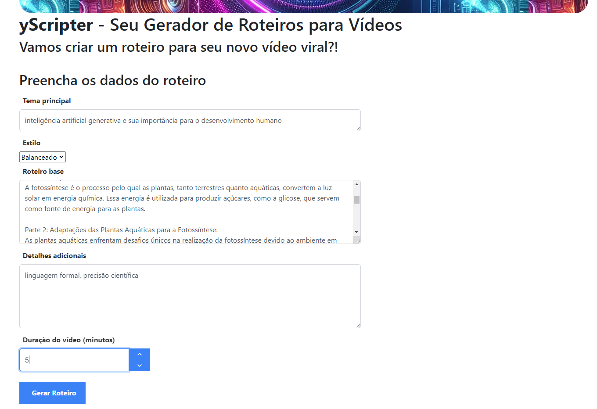

# yScripter
## Seu Gerador de Roteiros para Vídeos utilizando o Gemini, a Inteligência Artificial Generativa desenvolvida pela Google DeepMind

O **yScripter** é uma solução que permite aos usuários criar roteiros para vídeos de forma rápida e eficiente utilizando as funcionalidades do Gemini, a Inteligência Artificial Generativa desenvolvida pela Google DeepMind. Com esta ferramenta, os usuários podem gerar roteiros personalizados para uma ampla variedade de conteúdos de vídeo, desde tutoriais e apresentações até vídeos educacionais e comerciais.

## Como Funciona?
**Preenchimento de Parâmetros**: Os usuários são guiados através de um formulário onde podem inserir informações como o tema principal do vídeo, o estilo desejado, a duração e quaisquer detalhes adicionais.

**Base Multimídia**: O **yScripter** aceita como base de informação adicional vídeo, imagem ou documento.

**Geração de Roteiro**: Com base nos parâmetros fornecidos, o **yScripter** gera um roteiro personalizado para o vídeo, incorporando as preferências e especificações do usuário.

## Vídeo de apresentação do yScripter
*Em produção*

## Benefícios
**Eficiência e Produtividade**: Economiza tempo e esforço ao automatizar o processo de criação de roteiros, permitindo que os usuários se concentrem na criação de conteúdo de alta qualidade para seus vídeos.

**Flexibilidade e Personalização**: Oferece uma ampla gama de opções e recursos para atender às necessidades e preferências individuais dos usuários, garantindo que cada roteiro seja único e adequado ao seu contexto específico.

### Preenchimento de parâmetros

### Roteiro gerado por meio do Gemini, a ferramenta de IA Generativa desenvolvida pela Google DeepMind

## Funcionalidades:
- **Geração de Roteiros Personalizados:** Os usuários podem criar roteiros personalizados para seus vídeos, inserindo detalhes como o tema principal, o estilo desejado e a duração do vídeo.
- **Opções de Estilo e Estrutura:** O yScripter oferece opções para escolher entre diferentes estilos de roteiro, como preciso, balanceado ou criativo, e permite aos usuários adicionar detalhes específicos para personalizar ainda mais o conteúdo do roteiro.
- **Reutilização de Estrutura:** Os usuários têm a opção de reutilizar estruturas de roteiro existentes, facilitando a criação de scripts para vídeos similares ou sequências de vídeos.
- **Integração de Mídia (em desenvolvimento):** O yScripter permite aos usuários compor roteiros a partir do conteúdo de mídia existente, oferecendo a opção de fazer upload de arquivos de áudio, vídeo ou imagens para inspiração ou referência.

# Configuração do yScripter em ambiente de desenvolvimento
Para utilizar o yScripter, siga as instruções abaixo:
- [yScripter API - Guia de Configuração](yscripter-api/README.md)
- [yScripter App - Guia de Configuração](yscripter-app/README.md)
